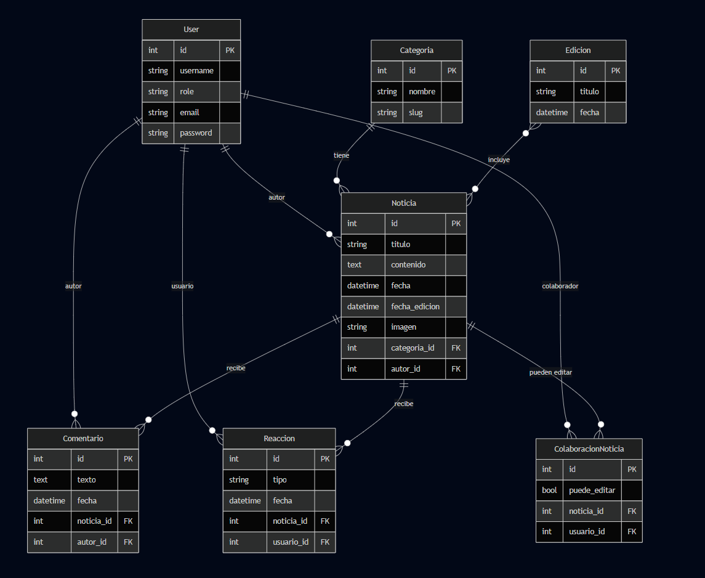

# 📰 Periódico Escolar Digital

## Descripción general

El **Periódico Escolar Digital** es una aplicación web desarrollada en **Django + PostgreSQL + Docker** que permite la **gestión, publicación y visualización de noticias escolares** clasificadas por categorías.  
El sistema simula un entorno periodístico real, con distintos roles de usuario y herramientas para interacción y control editorial.
---

## 🧩 Características principales

### ✏️ Publicación de noticias
- Creación, edición y eliminación de noticias desde el panel web.
- Cada noticia puede tener **imagen, contenido, autor, fecha y categoría**.
- Filtrado dinámico por categoría desde la página principal.

### 👥 Roles de usuario
| Rol | Permisos |
|------|-----------|
| **Redactor** | Puede crear y editar sus propias noticias. |
| **Editor** | Puede editar o eliminar cualquier noticia. |
| **Lector** | Puede visualizar, reaccionar y comentar noticias. |
| **Admin (Django)** | Gestiona usuarios, categorías y ediciones desde `/admin/`, pero no publica contenido desde el frontend. |

### 💬 Interacción
- **Comentarios** autenticados.
- **Reacciones** (👍 Likes / 👎 Dislikes) por usuario.
- Bloqueo automático para usuarios no registrados.

### 🗂️ Archivo histórico de ediciones
- Cada mes se genera automáticamente una **edición** con las noticias publicadas.
- Página dedicada para navegar por ediciones anteriores.
- Buscador con **calendario** para filtrar por fecha exacta.

### 🧠 Categorías predeterminadas
El sistema incluye categorías base para mantener una estructura mínima funcional:
- **Deportes**
- **Entretenimiento**
- **Escolar**
- **Ciencia y Tecnología**

---

## ⚙️ Arquitectura técnica

### 🔸 Tecnologías
- **Backend:** Django 5.1 + Django ORM  
- **Base de datos:** PostgreSQL  
- **Frontend:** HTML5, CSS3, JavaScript  
- **Infraestructura:** Docker y Docker Compose  
- **Servidor:** Contenedores `web` y `db` conectados mediante red interna  

### 🔸 Diagrama M.E.R.

## CLONAR REPOSITORIO
git clone https://github.com/SebastianGZB/Periodico-escolar.git

### 🐳 Despliegue con Docker

🚀 Levantar el entorno de desarrollo
docker compose -f docker-compose.dev.yml up --build

🧩 Verificar servicios activos
docker compose -f docker-compose.dev.yml ps

🧰 Crear superusuario
docker compose -f docker-compose.dev.yml exec web python manage.py createsuperuser

🗃️ Migraciones iniciales
docker compose -f docker-compose.dev.yml exec web python manage.py makemigrations
docker compose -f docker-compose.dev.yml exec web python manage.py migrate

Entrar a la pagina

http://127.0.0.1:8000/

ADMINISTRADOR
http://127.0.0.1:8000/admin
